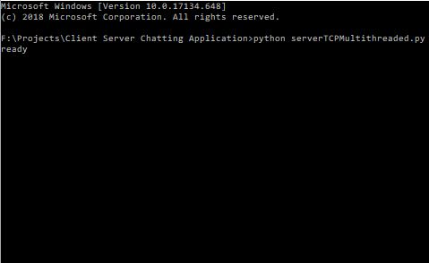
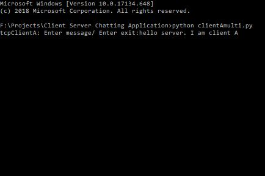
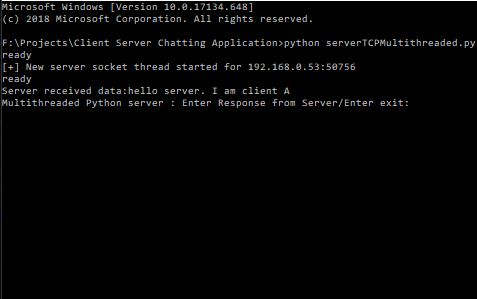
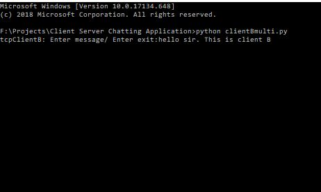
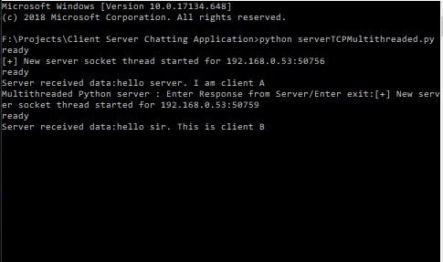
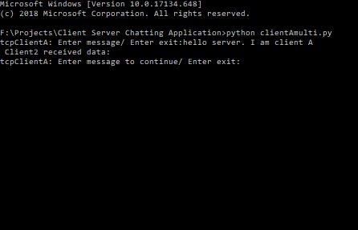
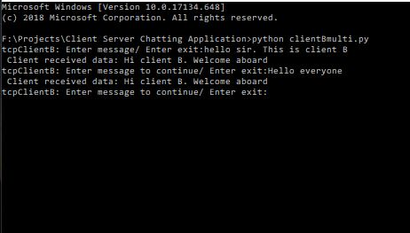
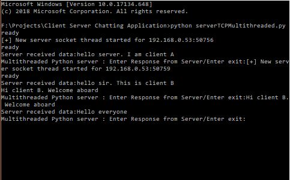

# Client-Server-Chatting-Application

This is a windows chatting application with client server interaction using TCP protocol. This application helps multiple clients to interact to the server at one time. This application is useful in developing QA forums where multiple users ask a single server different enquiry questions.

The following screenshots depict a scenario of client server interaction:

Fig1: Server is ready for chatting

Fig2(a): Client A is ready for chatting and has sent message to the server

Fig2(b): Server received the message of A

Fig3(a): Client B is ready for chatting and has sent message to the server

Fig3(b): Server recieved the message of client B

Fig3(c): Client A received the message of B

Fig4(a): Client B now sends hello message to all nodes

Fig4(b): Server sents message to B in return of his message

